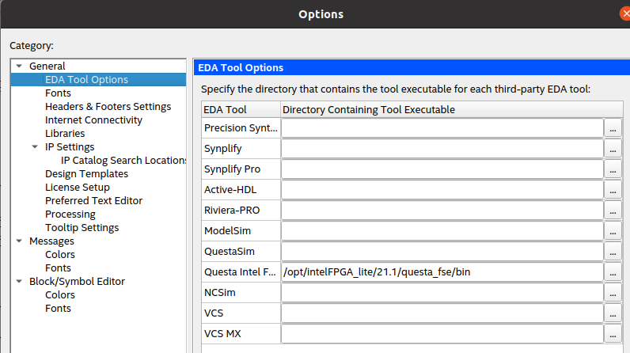

# Quartus 21 for Ubuntu 20.04
Setup instructions for Intel® Quartus® 21.x and Questa® for Ubuntu 20.04. These notes are intended for internal use at the University of Plymouth UK. This repository has been made public in case they should benefit others.

We have only tested this with a Terasic DE0-Nano FPGA board.

## Disclaimer
The notes below are collated from various sources in the Internet. 

* There is **NO GUARANTEE** these notes or scripts will work
* These notes are a best effort to install Quartus 21.1 on Ubuntu 20.04. They are subject to change in the light of new information.
* **Use at your own risk**. Neither the author or the University of Plymouth accept any liability for content of this repository. 

## Download and install Ubuntu 20.04 LTS
You will need an installation of Ubuntu Desktop 20.04 LTS. This can be obtained from https://ubuntu.com/download/desktop

Your will need to sign in a user with sudo rights (the default)

I have performed tests with both a Physical machine and a virtual machine (with USB pass-through).

## Download Quartus
The version we are using is Intel Quartus Prime Lite Edition, v21.1
https://www.intel.com/content/www/us/en/software/programmable/quartus-prime/download.html

You will probably need to create an account on the Intel site.

At the time of writing, a [direct link can be found here](https://www.intel.com/content/www/us/en/software-kit/684215/intel-quartus-prime-lite-edition-design-software-version-21-1-for-linux.html)

We download the following:

* Intel® Quartus® Prime (includes Nios® II EDS)
* Questa*-Intel® FPGA Edition
* Intel® Cyclone® IV Device Support

## Obtain a free License for Questa*-Intel® FPGA Starter Edition
For Questa, you will also need a license for your machine (linked to the hardware address of your network interface)

Visit the [Intel® FPGA Self-Service Licensing Center](https://www.intel.com/content/www/us/en/docs/programmable/683472/21-4/fpga-self-service-licensing-center.html) and create a single free license for Questa*-Intel® FPGA Starter Edition 

This results in a license file (extension .DAT) being emailed to your registered email address. You need to save this file on your machine.

## Install Quartus and Questa
Download all the installers for Quartus and Questa. You only need to run the Quartus Lite installer (this will install Questa for you)

All the files should be in the same folder. I am going to install locally (for just one user). We will discuss installing globally later.

Open a terminal and change to the directory with all the installers and type:

```bash
chmod +x QuartusLiteSetup-21.1.0.842-linux.run
```

This makes the installer e**x**ecutable. Now run the installer as follows:

```bash
./QuartusLiteSetup-21.1.0.842-linux.run
```

Follow the instructions on screen. By the end of this process, you should have an icon on the desktop. You might need to right-click this to allow it to be executable.

Note also that the precise filenames shown above might have changed by the time you do this.

## udev rules
Quartus should now be able to run, but by default, it will not have sufficient permissions to communicate with the DE0-Nano board.

The DE0-Nano board (like many) has a USB Blaster J-Tag programmer built in. This USB device will only be accessible by the root user. Quartus on the other hand will be running with normal user permissions. This is where `udev` comes in.

As a sudo user, create a file as folows:

```bash
sudo nano /etc/udev/rules.d/51-usbblaster.rules 
```

Paste in the following:

```bash
# USB-Blaster
SUBSYSTEM=="usb", ATTRS{idVendor}=="09fb", ATTRS{idProduct}=="6001", MODE="0666"
SUBSYSTEM=="usb", ATTRS{idVendor}=="09fb", ATTRS{idProduct}=="6002", MODE="0666"
SUBSYSTEM=="usb", ATTRS{idVendor}=="09fb", ATTRS{idProduct}=="6003", MODE="0666"
# USB-Blaster II
SUBSYSTEM=="usb", ATTRS{idVendor}=="09fb", ATTRS{idProduct}=="6010", MODE="0666"
SUBSYSTEM=="usb", ATTRS{idVendor}=="09fb", ATTRS{idProduct}=="6810", MODE="0666"
```

Alternatively, a copy of this file is included in this repository, in which case you would write:

```bash
sudo cp 51-usbblaster.rules /etc/udev/rules.d
```

Once the above is done, type the following:

```bash
sudo udevadm control --reload
```

At this point, I perform a **reboot**. I am not sure if this is needed, but I do it anyway :)

Now, when you plug in your USB-Blaster device, the permissions should be updated. 

### Confirming the udev rules (optional)

We can verify that udev has given us the correct permission by looking at the file system (all devices appear as files in Linux)

First, with the board plugged in, we can type the following:

```bash
lsusb | grep -i blaster
```

From this you can find the BUS and Device number. In my case, I get the following output:

```
Bus 001 Device 019: ID 09fb:6001 Altera Blaster
```

Knowing my device is device 019 on bus 001, I can inspect the permissions as follows:


```bash
ls -l /dev/bus/usb/001/019
```

and I see the following:

```bash
crw-rw-rw- 1 root root 189, 18 Jun 16 13:28 /dev/bus/usb/001/019
```

Note that user, group and other all have read (r) and write (w) access. Nice. Now we can proceed.


## Environmental Variables - User and License Path
Questa will not run unless you have a license for your machine.

This step assumes you've obtained a license file from Intel, and saved it in the `intelFPGA_lite` folder within your home directory.

You now need to edit the .bashrc file by typing:

```bash
nano .bashrc
```

Add the following to the end:

```bash
export QROOT="$HOME/intelFPGA_lite/21.1"
export QSYS_ROOTDIR="$QROOT/quartus/sopc_builder/bin"
export PATH=$PATH:$QROOT/questa_fse/bin:$QROOT/quartus/linux64:$QROOT/quartus/bin
export LM_LICENSE_FILE="$HOME/intelFPGA_lite/LR-084006_License.dat"
```

You may need to change `$QROOT` if you installed in another location. 

* The name of your license file will also be different to mine.

Save (CTRL-o) and exit (CTRL-x) from nano. For this to take immediate effect, you can type 

```bash
source .bashrc
```

You can also simply close your terminal and start another. The belt-and-braces option is to log out and back in again. To test, simply type the following:

```bash
vsim .
```

and Questa should launch. 

### Fixing NativeLink

Quartus can launch Questa from the context of your active project. Although you can now run Questa from the command line, you might find it does not launch from within Quartus (`Tools->Run Simulation Tool->RTL Simulation`).

The first thing you need to do is tell Quartus where the Questa simulator is located.

In Quartus, select `Tools->Options->EDA Tools Options`, and specify the folder where vsim is located.

<figure>

<figcaption>Complete the Questa Intel FPGA path</figcaption>
</figure>

However, unless you launch Quartus from the correct folder, this still does not seem to work. This seems to be related to checking the license file.

From the command line, you can fix this by running Quartus as follows:

```bash
bash -c "cd $QROOT/quartus/bin && ./quartus"
```

To launch via a shortcut (e.g. desktop icon), you can edit the desktop shortcut to achieve the same thing. In my case, I have a Quartus icon on the desktop. This is a file with extension `.desktop`. Editing this file, you should see something similar to the following:

```
[Desktop Entry]
Type=Application
Version=0.9.4
Name=Quartus (Quartus Prime 21.1) Lite Edition
Comment=Quartus (Quartus Prime 21.1)
Icon=/home/noutram/intelFPGA_lite/21.1/quartus/adm/quartusii.png
Exec=/home/noutram/intelFPGA_lite/21.1/quartus/bin/quartus --64bit
Terminal=false
Path=/home/noutram/intelFPGA_lite/21.1
```

Your paths will be different of course. The Path can be appended as follows:

```
Path=/home/noutram/intelFPGA_lite/21.1/quartus/bin
```

For reasons I confess, I do not fully understand the underlying issue here, but this seems to allow Native Link to work (as far as I can tell). It might be a relative path issue.

Another approach I've read is to set `LD_LIBRARY_PATH`, but I've also experienced problems using this approach.

## Programming the FPGA - workarounds

You can open the sample Quartus project included in this repository. What you are likely to discover is that the programming step does not work.

> When the programmer runs, it seems to look for the shared library `libudev.so.0`

If it is not present, then the programmer seems to block until it times out with the error message *Unable to read device chain - JTAG chain broken*

Version 0 of this library seems to have been removed from the Debian package repository. 

---

### Option 1 - Symbolic Link

On your system, you will likely find `libudev.so.1`. If not, you can install the libudev1 package as follows.

```bash
sudo apt install libudev1
```

If you are curious, type `dpkg -L libudev1` to confirm the exact version of the library and to see where it is installed.

With version 1 installed, as a **workaround**, the following seems to get things working:

```bash
sudo ln -sf /lib/$(arch)-linux-gnu/libudev.so.1 /lib/$(arch)-linux-gnu/libudev.so.0
```

> **Note** this really is only a **workaround**, and *there may be negative side-effects*.

If like me you prefer to avoid such work-arounds, there is another option.

---

### Option 2 - Install Old Package
You can look for old packages on the following site:

https://packages.ubuntu.com

Using this, you can search for, download and install `libudev0`. For example:

```bash
wget http://mirrors.kernel.org/ubuntu/pool/universe/libu/libudev0-shim/libudev0_200-1_amd64.deb

dpkg -i libudev0_200-1_amd64.deb
```
For me, this seems to be the most satisfactory solution and it *seems* to work.

---

### Testing 

To test either option 1 or option 2, plug in your board, open a terminal and type the following:

```bash
export LD_LIBRARY_PATH="$LD_LIBRARY_PATH:$QROOT/quartus/linux64"

jtagconfig
```

For my board (DE0-NANO), I see the following identifiers:

```
1) USB-Blaster [1-4.4.3]
020F30DD 10CL025(Y|Z)/EP3C25/EP4CE22
```

From this point, Quartus seems to work without further changes. 

---

**Note** 

There are other suggestions on the Internet. For the approach above, I do not need to run / kill `jtagd` or set any additional environmental variables as some sites suggest.

From this point, when you plug in your board, it should just work.

---
